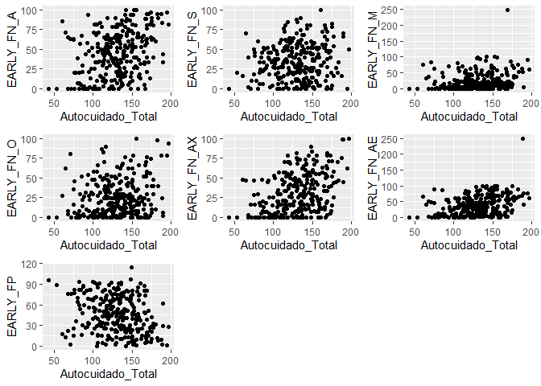
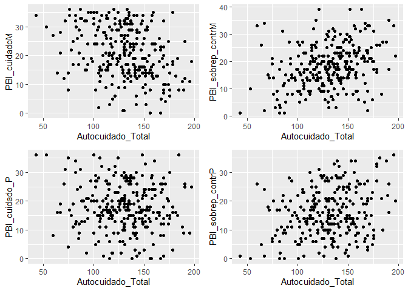
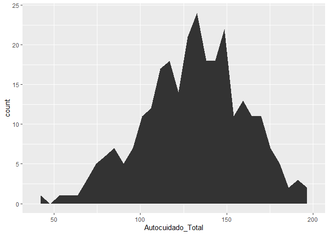

ASociaciación Autocuidado y experiencias adversas
================
Luis Ramudo
17/8/2019

``` r
knitr::opts_chunk$set(
    echo = FALSE,
    message = FALSE,
    warning = FALSE
)
library(knitr)
```

# Introudcción

## Objetivo e hipótesis

Analizar la relación del autocuidado actual con haber sufrido
experiencias adversas en la infancia. La hipótesis es que el autocuidado
será peor en personas que han sufrido experiencias adversas.

## Variables

Hay 3 escalas que cubren estos aspectos:

  - **EFI**: esta escala tiene dos partes “independientes”. Una en la
    que la persona responde SI/NO a una serie de items que reflejan
    eventos adversos, y otra parte en la que aparecen una serie de items
    y de ahí se extraen dos factores: experiencias positivas dentro de
    la familia, experiencias adversas dentro de la familia (Abandono
    emocional, Sobreprotección, Maltrato físico, Ver problemas en casa,
    Inversión de roles, Alta exigencia, Abuso emocional). Las variables
    con el nombre **EFI\_C** que dan cuenta de experiencias traumáticas
    ocurridas en la infancia. La descripción de cada experiencia viene
    en la etiqueta. **EARLY-FP**: Sumatorio de subescala de experiencias
    positivas dentro de la familia. **EARLY-FN**: (hay varias):
    puntuación de las subescalas de experiencias negativas en la
    infancia dentro de la familia. **EARLY-G**: Sumatorio de numero de
    eventos traumaticos en la infancia.

  - **PBI**: esta escala refleja los estilos de crianza materno y
    paterno por separado. Y se obtienen dos puntuaciones para cada
    progenitor, una de Cuidado y otra de Sobreprotección. Son, por
    tanto, cuatro variables: **cuidado y sobreprotección materno y
    paterno**.

  - **Autocuidado**: es una escala sin puntos de corte, se obtiene
    puntuaciones para 6 factores: Conducta autodestructiva, Falta de
    tolerancia al afecto positivo, Problemas para dejarse ayudar,
    Resentimiento por no reciprocidad, No actividades positivas, No
    atender las propias necesidades.

## Propuesta de análisis

Lo que se pretende sería ver:

  - Si hay relación entre las puntuaciones en los factores de la escala
    de autocuidado y los eventos adversos que se reflejan en la primera
    parte de la EFI. Para esto se ralizará la evaluación de asociación
    mediante modelos de regresión múltiple entre las variables
    \[Autocuidado\_Total\] y \[EARLY\_FN\_A, EARLY\_FN\_S, EARLY\_FN\_M,
    EARLY\_FN\_O, EARLY\_FN\_AX, EARLY\_FN\_AE\].
  - Si hay relación entre las puntuaciones en los factores de la escala
    de autocuidado y los factores de la EFI y el PBI. \[PBI\_cuidadoM,
    PBI\_sobrep\_contrM, PBI\_cuidado\_P, PBI\_sobrep\_contrP\]
  - Variables para incluir en el modelo de traumatismo: Abuso sexual
    intrafamiliar, Presenciar o sufrir violencia extrafamiliar,
    Bullying, Agresión o burlas profesor, Muerte, enfermedad o abuso de
    substancias de un familiar, Problemas sentimentales o con amigos:
    \[AS\_intrafamiliar, Violencia\_extrafamiliar, Bullying\_niños,
    Profesor\_agresor, Muerte\_enfermedad\_familiar,
    Problemas\_amigos\_Sentimentales\]

# Desarrollo

Carga de la base de datos “BaseAutocuidado.sav”. La base está en formato
SPSS. Elimino las variables no empleadas en el
análisis

## Asociación entre autocuidado y EARLY

### Examen de variables empleadas y análisis de correlación las variables EARLY

    ## Classes 'tbl_df', 'tbl' and 'data.frame':    279 obs. of  8 variables:
    ##  $ Autocuidado_Total: num  114 128 130 85 125 138 108 75 105 109 ...
    ##   ..- attr(*, "label")= chr "Autocuidado total"
    ##   ..- attr(*, "format.spss")= chr "F8.2"
    ##   ..- attr(*, "display_width")= int 19
    ##  $ EARLY_FP         : num  25.26 75.79 4.74 16.32 74.74 ...
    ##   ..- attr(*, "label")= chr "Cuidado positivo en el entorno familiar"
    ##   ..- attr(*, "format.spss")= chr "F8.2"
    ##   ..- attr(*, "display_width")= int 11
    ##  $ EARLY_FN_A       : num  36.67 11.67 63.33 66.67 3.33 ...
    ##   ..- attr(*, "label")= chr "Abandono emocional"
    ##   ..- attr(*, "format.spss")= chr "F8.2"
    ##   ..- attr(*, "display_width")= int 12
    ##  $ EARLY_FN_S       : num  NA 20 2 46 20 8 0 50 0 14 ...
    ##   ..- attr(*, "label")= chr "Sobreprotección"
    ##   ..- attr(*, "format.spss")= chr "F8.2"
    ##   ..- attr(*, "display_width")= int 12
    ##  $ EARLY_FN_M       : num  50 6 96 50 2 0 0 14 82 22 ...
    ##   ..- attr(*, "label")= chr "Maltrato físico"
    ##   ..- attr(*, "format.spss")= chr "F8.2"
    ##   ..- attr(*, "display_width")= int 12
    ##  $ EARLY_FN_O       : num  50 10 0 52 18 4 2 16 58 52 ...
    ##   ..- attr(*, "label")= chr "Ver problemas en casa"
    ##   ..- attr(*, "format.spss")= chr "F8.2"
    ##   ..- attr(*, "display_width")= int 12
    ##  $ EARLY_FN_AX      : num  70 6.67 33.33 48.33 5 ...
    ##   ..- attr(*, "label")= chr "Alta exigencia"
    ##   ..- attr(*, "format.spss")= chr "F8.2"
    ##   ..- attr(*, "display_width")= int 13
    ##  $ EARLY_FN_AE      : num  76.7 25 66.7 86.7 5 ...
    ##   ..- attr(*, "label")= chr "Albuso emocional"
    ##   ..- attr(*, "format.spss")= chr "F8.2"
    ##   ..- attr(*, "display_width")= int 13

|                    | Autocuidado\_Total |   EARLY\_FP | EARLY\_FN\_A | EARLY\_FN\_S | EARLY\_FN\_M | EARLY\_FN\_O | EARLY\_FN\_AX | EARLY\_FN\_AE |
| ------------------ | -----------------: | ----------: | -----------: | -----------: | -----------: | -----------: | ------------: | ------------: |
| Autocuidado\_Total |          1.0000000 | \-0.2593089 |    0.3429605 |    0.1088652 |    0.1877988 |    0.1692828 |     0.3826922 |     0.3301279 |
| EARLY\_FP          |        \-0.2593089 |   1.0000000 |  \-0.7919585 |    0.3125914 |  \-0.5409855 |  \-0.5106215 |   \-0.5220208 |   \-0.6855522 |
| EARLY\_FN\_A       |          0.3429605 | \-0.7919585 |    1.0000000 |  \-0.1361671 |    0.5600935 |    0.6044002 |     0.6708989 |     0.7332590 |
| EARLY\_FN\_S       |          0.1088652 |   0.3125914 |  \-0.1361671 |    1.0000000 |  \-0.2399140 |  \-0.0798092 |     0.0647934 |   \-0.0084272 |
| EARLY\_FN\_M       |          0.1877988 | \-0.5409855 |    0.5600935 |  \-0.2399140 |    1.0000000 |    0.5262085 |     0.4778477 |     0.6035174 |
| EARLY\_FN\_O       |          0.1692828 | \-0.5106215 |    0.6044002 |  \-0.0798092 |    0.5262085 |    1.0000000 |     0.4291816 |     0.4432540 |
| EARLY\_FN\_AX      |          0.3826922 | \-0.5220208 |    0.6708989 |    0.0647934 |    0.4778477 |    0.4291816 |     1.0000000 |     0.7313498 |
| EARLY\_FN\_AE      |          0.3301279 | \-0.6855522 |    0.7332590 |  \-0.0084272 |    0.6035174 |    0.4432540 |     0.7313498 |     1.0000000 |

### Análisis gráfico de asociación de autocuidado con las variables predictoras EARLY

<!-- -->

### Modelo de regresión lineal EARLY

    ## 
    ## Call:
    ## lm(formula = Autocuidado_Total ~ EARLY_FP + EARLY_FN_A + EARLY_FN_S + 
    ##     EARLY_FN_M + EARLY_FN_O + EARLY_FN_AX + EARLY_FN_AE, data = Base_red)
    ## 
    ## Residuals:
    ##     Min      1Q  Median      3Q     Max 
    ## -82.017 -17.160  -0.564  18.713  55.087 
    ## 
    ## Coefficients:
    ##               Estimate Std. Error t value Pr(>|t|)    
    ## (Intercept) 111.525104   8.844316  12.610  < 2e-16 ***
    ## EARLY_FP     -0.052020   0.112574  -0.462  0.64439    
    ## EARLY_FN_A    0.199434   0.113738   1.753  0.08068 .  
    ## EARLY_FN_S    0.164682   0.081951   2.010  0.04550 *  
    ## EARLY_FN_M   -0.001227   0.082024  -0.015  0.98808    
    ## EARLY_FN_O   -0.089586   0.092734  -0.966  0.33490    
    ## EARLY_FN_AX   0.285418   0.103554   2.756  0.00625 ** 
    ## EARLY_FN_AE   0.009886   0.108184   0.091  0.92726    
    ## ---
    ## Signif. codes:  0 '***' 0.001 '**' 0.01 '*' 0.05 '.' 0.1 ' ' 1
    ## 
    ## Residual standard error: 26.64 on 265 degrees of freedom
    ##   (6 observations deleted due to missingness)
    ## Multiple R-squared:  0.1774, Adjusted R-squared:  0.1556 
    ## F-statistic: 8.161 on 7 and 265 DF,  p-value: 5.299e-09

Modelo con variables estadísticamente significativas

    ## 
    ## Call:
    ## lm(formula = Autocuidado_Total ~ EARLY_FN_A + EARLY_FN_S + EARLY_FN_AX, 
    ##     data = Base_red)
    ## 
    ## Residuals:
    ##    Min     1Q Median     3Q    Max 
    ## -81.94 -17.66  -0.09  18.56  55.13 
    ## 
    ## Coefficients:
    ##              Estimate Std. Error t value Pr(>|t|)    
    ## (Intercept) 107.71868    4.05986  26.533  < 2e-16 ***
    ## EARLY_FN_A    0.19691    0.07747   2.542  0.01160 *  
    ## EARLY_FN_S    0.15220    0.07284   2.090  0.03760 *  
    ## EARLY_FN_AX   0.28826    0.09056   3.183  0.00163 ** 
    ## ---
    ## Signif. codes:  0 '***' 0.001 '**' 0.01 '*' 0.05 '.' 0.1 ' ' 1
    ## 
    ## Residual standard error: 26.46 on 270 degrees of freedom
    ##   (5 observations deleted due to missingness)
    ## Multiple R-squared:  0.173,  Adjusted R-squared:  0.1638 
    ## F-statistic: 18.82 on 3 and 270 DF,  p-value: 4.092e-11

Modelo con interacción (efecto aditivo)

    ## 
    ## Call:
    ## lm(formula = Autocuidado_Total ~ EARLY_FN_A * EARLY_FN_S * EARLY_FN_AX, 
    ##     data = Base_red)
    ## 
    ## Residuals:
    ##    Min     1Q Median     3Q    Max 
    ## -82.61 -18.39  -0.97  20.02  57.86 
    ## 
    ## Coefficients:
    ##                                     Estimate Std. Error t value Pr(>|t|)
    ## (Intercept)                        9.859e+01  7.040e+00  14.004   <2e-16
    ## EARLY_FN_A                         3.678e-01  1.581e-01   2.326   0.0208
    ## EARLY_FN_S                         3.880e-01  1.805e-01   2.149   0.0325
    ## EARLY_FN_AX                        4.818e-01  3.190e-01   1.510   0.1321
    ## EARLY_FN_A:EARLY_FN_S             -4.741e-03  4.371e-03  -1.085   0.2790
    ## EARLY_FN_A:EARLY_FN_AX            -2.468e-03  4.419e-03  -0.558   0.5770
    ## EARLY_FN_S:EARLY_FN_AX            -2.724e-03  7.454e-03  -0.365   0.7151
    ## EARLY_FN_A:EARLY_FN_S:EARLY_FN_AX  2.964e-05  1.140e-04   0.260   0.7951
    ##                                      
    ## (Intercept)                       ***
    ## EARLY_FN_A                        *  
    ## EARLY_FN_S                        *  
    ## EARLY_FN_AX                          
    ## EARLY_FN_A:EARLY_FN_S                
    ## EARLY_FN_A:EARLY_FN_AX               
    ## EARLY_FN_S:EARLY_FN_AX               
    ## EARLY_FN_A:EARLY_FN_S:EARLY_FN_AX    
    ## ---
    ## Signif. codes:  0 '***' 0.001 '**' 0.01 '*' 0.05 '.' 0.1 ' ' 1
    ## 
    ## Residual standard error: 26.48 on 266 degrees of freedom
    ##   (5 observations deleted due to missingness)
    ## Multiple R-squared:  0.1841, Adjusted R-squared:  0.1626 
    ## F-statistic: 8.574 on 7 and 266 DF,  p-value: 1.774e-09

## Asociación entre autocuidado y PBI

### Examen de variables empleadas y análisis de correlación las variables PBI

    ## Classes 'tbl_df', 'tbl' and 'data.frame':    279 obs. of  5 variables:
    ##  $ Autocuidado_Total: num  114 128 130 85 125 138 108 75 105 109 ...
    ##   ..- attr(*, "label")= chr "Autocuidado total"
    ##   ..- attr(*, "format.spss")= chr "F8.2"
    ##   ..- attr(*, "display_width")= int 19
    ##  $ PBI_cuidadoM     : num  16 25 1 17 29 31 34 14 2 24 ...
    ##   ..- attr(*, "label")= chr "PBI Cuidado Materno"
    ##   ..- attr(*, "format.spss")= chr "F4.0"
    ##  $ PBI_sobrep_contrM: num  22 18 22 31 12 3 6 19 13 14 ...
    ##   ..- attr(*, "label")= chr "PBI Sobreprotección/Control Materno"
    ##   ..- attr(*, "format.spss")= chr "F4.0"
    ##  $ PBI_cuidado_P    : num  22 29 28 7 20 28 32 4 15 20 ...
    ##   ..- attr(*, "label")= chr "PBI Cuidado Paterno"
    ##   ..- attr(*, "format.spss")= chr "F4.0"
    ##   ..- attr(*, "display_width")= int 10
    ##  $ PBI_sobrep_contrP: num  14 10 14 20 12 0 7 7 9 13 ...
    ##   ..- attr(*, "label")= chr "PBI Sobreprotección/Control Paterno"
    ##   ..- attr(*, "format.spss")= chr "F4.0"

|                     | Autocuidado\_Total | PBI\_cuidadoM | PBI\_sobrep\_contrM | PBI\_cuidado\_P | PBI\_sobrep\_contrP |
| ------------------- | -----------------: | ------------: | ------------------: | --------------: | ------------------: |
| Autocuidado\_Total  |          1.0000000 |   \-0.2889155 |           0.2719439 |     \-0.0917677 |           0.2483876 |
| PBI\_cuidadoM       |        \-0.2889155 |     1.0000000 |         \-0.4270788 |       0.3018872 |         \-0.1772916 |
| PBI\_sobrep\_contrM |          0.2719439 |   \-0.4270788 |           1.0000000 |     \-0.1675899 |           0.4352033 |
| PBI\_cuidado\_P     |        \-0.0917677 |     0.3018872 |         \-0.1675899 |       1.0000000 |         \-0.2730044 |
| PBI\_sobrep\_contrP |          0.2483876 |   \-0.1772916 |           0.4352033 |     \-0.2730044 |           1.0000000 |

### Análisis gráfico de asociación de autocuidado con las variables predictoras PBI

<!-- -->

### Modelo de regresión lineal PBI

    ## 
    ## Call:
    ## lm(formula = Autocuidado_Total ~ PBI_cuidadoM + PBI_sobrep_contrM + 
    ##     PBI_cuidado_P + PBI_sobrep_contrP, data = Base_red)
    ## 
    ## Residuals:
    ##     Min      1Q  Median      3Q     Max 
    ## -76.524 -17.777   1.204  18.871  59.337 
    ## 
    ## Coefficients:
    ##                   Estimate Std. Error t value Pr(>|t|)    
    ## (Intercept)       126.5063     8.3911  15.076  < 2e-16 ***
    ## PBI_cuidadoM       -0.7400     0.2178  -3.398 0.000784 ***
    ## PBI_sobrep_contrM   0.4000     0.2594   1.542 0.124310    
    ## PBI_cuidado_P       0.1462     0.2201   0.664 0.507200    
    ## PBI_sobrep_contrP   0.6011     0.2289   2.627 0.009136 ** 
    ## ---
    ## Signif. codes:  0 '***' 0.001 '**' 0.01 '*' 0.05 '.' 0.1 ' ' 1
    ## 
    ## Residual standard error: 26.86 on 261 degrees of freedom
    ##   (13 observations deleted due to missingness)
    ## Multiple R-squared:  0.1334, Adjusted R-squared:  0.1201 
    ## F-statistic: 10.04 on 4 and 261 DF,  p-value: 1.418e-07

Modelo con variables estadísticamente significativas

    ## 
    ## Call:
    ## lm(formula = Autocuidado_Total ~ PBI_cuidadoM + PBI_sobrep_contrP, 
    ##     data = Base_red)
    ## 
    ## Residuals:
    ##    Min     1Q Median     3Q    Max 
    ## -72.64 -18.38   2.38  18.60  62.81 
    ## 
    ## Coefficients:
    ##                   Estimate Std. Error t value Pr(>|t|)    
    ## (Intercept)       137.1956     5.8849  23.313  < 2e-16 ***
    ## PBI_cuidadoM       -0.8589     0.1930  -4.451 1.26e-05 ***
    ## PBI_sobrep_contrP   0.7169     0.2043   3.509 0.000529 ***
    ## ---
    ## Signif. codes:  0 '***' 0.001 '**' 0.01 '*' 0.05 '.' 0.1 ' ' 1
    ## 
    ## Residual standard error: 26.99 on 264 degrees of freedom
    ##   (12 observations deleted due to missingness)
    ## Multiple R-squared:  0.1288, Adjusted R-squared:  0.1222 
    ## F-statistic: 19.52 on 2 and 264 DF,  p-value: 1.242e-08

Modelo con interacción (efecto aditivo)

    ## 
    ## Call:
    ## lm(formula = Autocuidado_Total ~ PBI_cuidadoM * PBI_sobrep_contrP, 
    ##     data = Base_red)
    ## 
    ## Residuals:
    ##     Min      1Q  Median      3Q     Max 
    ## -73.784 -18.048   2.108  18.642  62.571 
    ## 
    ## Coefficients:
    ##                                 Estimate Std. Error t value Pr(>|t|)    
    ## (Intercept)                    142.50192    9.77718  14.575  < 2e-16 ***
    ## PBI_cuidadoM                    -1.09850    0.40179  -2.734  0.00668 ** 
    ## PBI_sobrep_contrP                0.38578    0.52819   0.730  0.46581    
    ## PBI_cuidadoM:PBI_sobrep_contrP   0.01554    0.02286   0.680  0.49710    
    ## ---
    ## Signif. codes:  0 '***' 0.001 '**' 0.01 '*' 0.05 '.' 0.1 ' ' 1
    ## 
    ## Residual standard error: 27.01 on 263 degrees of freedom
    ##   (12 observations deleted due to missingness)
    ## Multiple R-squared:  0.1304, Adjusted R-squared:  0.1204 
    ## F-statistic: 13.14 on 3 and 263 DF,  p-value: 5.07e-08

## Asociación entre autocuidado, EARLY y PBI

|                     | Autocuidado\_Total |   EARLY\_FP | EARLY\_FN\_A | EARLY\_FN\_S | EARLY\_FN\_M | EARLY\_FN\_O | EARLY\_FN\_AX | EARLY\_FN\_AE | PBI\_cuidadoM | PBI\_sobrep\_contrM | PBI\_cuidado\_P | PBI\_sobrep\_contrP |
| ------------------- | -----------------: | ----------: | -----------: | -----------: | -----------: | -----------: | ------------: | ------------: | ------------: | ------------------: | --------------: | ------------------: |
| Autocuidado\_Total  |          1.0000000 | \-0.2321712 |    0.3156255 |    0.1045118 |    0.1712664 |    0.1542162 |     0.3560355 |     0.2997676 |   \-0.2916878 |           0.2735098 |     \-0.0905395 |           0.2488914 |
| EARLY\_FP           |        \-0.2321712 |   1.0000000 |  \-0.7819594 |    0.3234591 |  \-0.5340075 |  \-0.4975354 |   \-0.5037446 |   \-0.6746623 |     0.7409871 |         \-0.4050066 |       0.4849147 |         \-0.3084437 |
| EARLY\_FN\_A        |          0.3156255 | \-0.7819594 |    1.0000000 |  \-0.1434676 |    0.5521843 |    0.5954645 |     0.6564860 |     0.7245943 |   \-0.6503550 |           0.4272577 |     \-0.4209209 |           0.2988820 |
| EARLY\_FN\_S        |          0.1045118 |   0.3234591 |  \-0.1434676 |    1.0000000 |  \-0.2429274 |  \-0.0696349 |     0.0542643 |   \-0.0189021 |     0.2357743 |           0.2221998 |       0.1130662 |           0.0155158 |
| EARLY\_FN\_M        |          0.1712664 | \-0.5340075 |    0.5521843 |  \-0.2429274 |    1.0000000 |    0.5046976 |     0.4666296 |     0.5994294 |   \-0.3937008 |           0.2593703 |     \-0.2552667 |           0.3500521 |
| EARLY\_FN\_O        |          0.1542162 | \-0.4975354 |    0.5954645 |  \-0.0696349 |    0.5046976 |    1.0000000 |     0.4174474 |     0.4326809 |   \-0.3344689 |           0.2503020 |     \-0.2988710 |           0.2307287 |
| EARLY\_FN\_AX       |          0.3560355 | \-0.5037446 |    0.6564860 |    0.0542643 |    0.4666296 |    0.4174474 |     1.0000000 |     0.7212019 |   \-0.4301952 |           0.4754467 |     \-0.2450135 |           0.3633550 |
| EARLY\_FN\_AE       |          0.2997676 | \-0.6746623 |    0.7245943 |  \-0.0189021 |    0.5994294 |    0.4326809 |     0.7212019 |     1.0000000 |   \-0.5792969 |           0.5106782 |     \-0.3017922 |           0.3905475 |
| PBI\_cuidadoM       |        \-0.2916878 |   0.7409871 |  \-0.6503550 |    0.2357743 |  \-0.3937008 |  \-0.3344689 |   \-0.4301952 |   \-0.5792969 |     1.0000000 |         \-0.4260479 |       0.3055885 |         \-0.1831911 |
| PBI\_sobrep\_contrM |          0.2735098 | \-0.4050066 |    0.4272577 |    0.2221998 |    0.2593703 |    0.2503020 |     0.4754467 |     0.5106782 |   \-0.4260479 |           1.0000000 |     \-0.1692064 |           0.4422567 |
| PBI\_cuidado\_P     |        \-0.0905395 |   0.4849147 |  \-0.4209209 |    0.1130662 |  \-0.2552667 |  \-0.2988710 |   \-0.2450135 |   \-0.3017922 |     0.3055885 |         \-0.1692064 |       1.0000000 |         \-0.2735974 |
| PBI\_sobrep\_contrP |          0.2488914 | \-0.3084437 |    0.2988820 |    0.0155158 |    0.3500521 |    0.2307287 |     0.3633550 |     0.3905475 |   \-0.1831911 |           0.4422567 |     \-0.2735974 |           1.0000000 |

### Modelo de regresión lineal PBI

    ## 
    ## Call:
    ## lm(formula = Autocuidado_Total ~ EARLY_FP + EARLY_FN_A + EARLY_FN_S + 
    ##     EARLY_FN_M + EARLY_FN_O + EARLY_FN_AX + EARLY_FN_AE, data = Base_red, 
    ##     subset = PBI_cuidadoM + PBI_sobrep_contrM + PBI_cuidado_P + 
    ##         PBI_sobrep_contrP)
    ## 
    ## Residuals:
    ##     Min      1Q  Median      3Q     Max 
    ## -65.745 -23.226   3.903  17.773  48.718 
    ## 
    ## Coefficients:
    ##              Estimate Std. Error t value Pr(>|t|)    
    ## (Intercept) 154.70096   11.58790  13.350  < 2e-16 ***
    ## EARLY_FP     -0.61888    0.15506  -3.991 8.61e-05 ***
    ## EARLY_FN_A   -0.05379    0.13780  -0.390  0.69658    
    ## EARLY_FN_S    0.19849    0.09549   2.079  0.03866 *  
    ## EARLY_FN_M   -0.38808    0.12790  -3.034  0.00266 ** 
    ## EARLY_FN_O    0.21074    0.12697   1.660  0.09822 .  
    ## EARLY_FN_AX   0.40848    0.13494   3.027  0.00272 ** 
    ## EARLY_FN_AE  -0.19437    0.13035  -1.491  0.13717    
    ## ---
    ## Signif. codes:  0 '***' 0.001 '**' 0.01 '*' 0.05 '.' 0.1 ' ' 1
    ## 
    ## Residual standard error: 28.24 on 253 degrees of freedom
    ##   (18 observations deleted due to missingness)
    ## Multiple R-squared:  0.2251, Adjusted R-squared:  0.2036 
    ## F-statistic:  10.5 on 7 and 253 DF,  p-value: 1.411e-11

## Categorizacion autocuiado

Distribución de frecuencias de la variable autocuidado
<!-- -->

## Asociación entre EFI y autocuidado

## Asociación entre autocuidado y EFI

|                                  | Autocuidado\_Total | AS\_intrafamiliar | Violencia\_extrafamiliar | Bullying\_niños | Profesor\_agresor | Muerte\_enfermedad\_familiar | Problemas\_amigos\_Sentimentales |
| -------------------------------- | -----------------: | ----------------: | -----------------------: | --------------: | ----------------: | ---------------------------: | -------------------------------: |
| Autocuidado\_Total               |          1.0000000 |         0.1895809 |                0.1311058 |       0.1662595 |         0.2032559 |                    0.1223368 |                        0.1877997 |
| AS\_intrafamiliar                |          0.1895809 |         1.0000000 |                0.2095938 |       0.0558855 |         0.0786399 |                    0.2024448 |                        0.1242033 |
| Violencia\_extrafamiliar         |          0.1311058 |         0.2095938 |                1.0000000 |       0.1439412 |         0.1992032 |                    0.1670109 |                        0.3202757 |
| Bullying\_niños                  |          0.1662595 |         0.0558855 |                0.1439412 |       1.0000000 |         0.1499323 |                    0.0040038 |                        0.3232311 |
| Profesor\_agresor                |          0.2032559 |         0.0786399 |                0.1992032 |       0.1499323 |         1.0000000 |                    0.1092636 |                        0.1767853 |
| Muerte\_enfermedad\_familiar     |          0.1223368 |         0.2024448 |                0.1670109 |       0.0040038 |         0.1092636 |                    1.0000000 |                        0.1355994 |
| Problemas\_amigos\_Sentimentales |          0.1877997 |         0.1242033 |                0.3202757 |       0.3232311 |         0.1767853 |                    0.1355994 |                        1.0000000 |

### Modelo de regresión lineal EFI

    ## 
    ## Call:
    ## lm(formula = Autocuidado_Total ~ ., data = Base_red_EFI_C)
    ## 
    ## Residuals:
    ##     Min      1Q  Median      3Q     Max 
    ## -81.710 -16.810   1.916  22.190  56.113 
    ## 
    ## Coefficients:
    ##                                Estimate Std. Error t value Pr(>|t|)    
    ## (Intercept)                     118.810      3.244  36.621   <2e-16 ***
    ## AS_intrafamiliar                 11.563      4.795   2.412   0.0165 *  
    ## Violencia_extrafamiliar           1.024      4.294   0.238   0.8118    
    ## Bullying_niños                    5.900      3.556   1.659   0.0982 .  
    ## Profesor_agresor                  9.374      3.737   2.509   0.0127 *  
    ## Muerte_enfermedad_familiar        3.590      3.544   1.013   0.3119    
    ## Problemas_amigos_Sentimentales    6.376      4.207   1.516   0.1308    
    ## ---
    ## Signif. codes:  0 '***' 0.001 '**' 0.01 '*' 0.05 '.' 0.1 ' ' 1
    ## 
    ## Residual standard error: 27.79 on 270 degrees of freedom
    ##   (2 observations deleted due to missingness)
    ## Multiple R-squared:  0.1025, Adjusted R-squared:  0.08252 
    ## F-statistic: 5.137 on 6 and 270 DF,  p-value: 5.108e-05

Modelo con variables estadísticamente significativas

    ## 
    ## Call:
    ## lm(formula = Autocuidado_Total ~ AS_intrafamiliar + Profesor_agresor, 
    ##     data = Base_red_EFI_C)
    ## 
    ## Residuals:
    ##     Min      1Q  Median      3Q     Max 
    ## -81.832 -18.832   3.168  21.308  58.201 
    ## 
    ## Coefficients:
    ##                  Estimate Std. Error t value Pr(>|t|)    
    ## (Intercept)       124.832      2.127  58.690  < 2e-16 ***
    ## AS_intrafamiliar   13.968      4.669   2.992  0.00303 ** 
    ## Profesor_agresor   11.861      3.654   3.246  0.00132 ** 
    ## ---
    ## Signif. codes:  0 '***' 0.001 '**' 0.01 '*' 0.05 '.' 0.1 ' ' 1
    ## 
    ## Residual standard error: 28.05 on 274 degrees of freedom
    ##   (2 observations deleted due to missingness)
    ## Multiple R-squared:  0.07164,    Adjusted R-squared:  0.06486 
    ## F-statistic: 10.57 on 2 and 274 DF,  p-value: 3.779e-05

Modelo con interacción (efecto aditivo)

    ## 
    ## Call:
    ## lm(formula = Autocuidado_Total ~ AS_intrafamiliar * Profesor_agresor, 
    ##     data = Base_red_EFI_C)
    ## 
    ## Residuals:
    ##     Min      1Q  Median      3Q     Max 
    ## -82.442 -18.442   2.558  21.558  62.077 
    ## 
    ## Coefficients:
    ##                                   Estimate Std. Error t value Pr(>|t|)    
    ## (Intercept)                        125.442      2.182  57.495   <2e-16 ***
    ## AS_intrafamiliar                     9.481      5.913   1.603   0.1100    
    ## Profesor_agresor                     9.789      4.018   2.436   0.0155 *  
    ## AS_intrafamiliar:Profesor_agresor   11.876      9.621   1.234   0.2181    
    ## ---
    ## Signif. codes:  0 '***' 0.001 '**' 0.01 '*' 0.05 '.' 0.1 ' ' 1
    ## 
    ## Residual standard error: 28.03 on 273 degrees of freedom
    ##   (2 observations deleted due to missingness)
    ## Multiple R-squared:  0.07679,    Adjusted R-squared:  0.06664 
    ## F-statistic: 7.569 on 3 and 273 DF,  p-value: 7.003e-05
